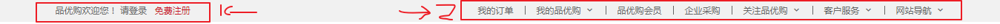

# 品优购

## 品优购项目规划

### 整体介绍

- 项目名称：品优购
- 描述:是一个电商网站，我们要完成pc端首页、列表页、注册页面的制作

### 学习目的

1. 电商类网站比较综合，里面需要大量的布局技术，包括布局方式、常见效果以及周边技术
2. 能复习、总结、提高基础班所学布局技术
3. 写完品优购项目，能对实际开发中制作PC端页面流程有一个整体的感知。
4. 为后期学习移动端项目做铺垫。

### 开发工具以及技术栈

1. 开发工具

VScode、photoshop(fw)、主流浏览器(以Chrome浏览器为主)

2. 技术栈

- 利用HTML5 + CSS3手动布局，可以大量使用H5新增标签和样式
- 采取结构与样式相分离，模块化开发
- 良好的代码规范有利于团队更好的开发协作，提高代码质量，因此品优购项目里面，遵循以下代码规范(品优购代码规范.md)

### 品优购项目搭建工作

1. 需要创建如下文件夹

- 项目文件夹：shopping
- 样式类图片文件夹：images
- 样式文件夹：css
- 产品类图片文件夹：upload
- 字体类文件夹：fonts
- 脚本文件夹：js

2. 创建如下文件：

- 首页：index.html
- css初始化样式文件：base.css
- css公共样式文件：common.css

3. 模块化开发

所谓的模块化：将一个项目按照功能划分，一个功能一个模块，互不影响
模模块化开发具有重复使用，更换方便等优点

- 代码也如此，有些样式和结构在很多页面都会出现，比如页面头部和底部，大部分页面都有，此时，可以吧这些结构和样式单独作为一个模块，然后重复使用
- 这里最典型的应用就是common.css公共样式，写好一个样式，其余的页面用到这些相同的样式
- 模块化开发具有重复使用、修改方便等优点
- common.css公共样式里面包含版心宽度、清除浮动、页面文字颜色等公共样式

4. 网站favicon图标

### 制作favicon图标

1. 把品优购图标切成png图片
2. 把png图片转换为ico图标，这需要借助于第三方转换网站，例如**比特虫：http://www.bitbug.net/**

### favicon图标放到网站根目录下

### HTML页面引入favicon图标

5. 网站TDK三大标签SEO优化

**SEO(Search Engine Optimization)**汉译为**搜索引擎优化**，是一种利用搜索引擎的规则提高网站在有关搜索引擎内自然排名的方式

SEO的目的是**对网站进行深度的优化**，从而帮助网站获取免费的流量，进而在搜索引擎上提升网站的排名，提高网站的知名度

页面必须有三个标签用来符合SEO优化。

三大标签：title、description、keywords

- title网站标题

title具有不可替代性，是我们内页的第一个重要标签，是搜索引擎了解网页的入口和对网页主题归属的最佳判断点。

建议：**网站名(产品名)-网站的介绍**(尽量不要超过30个汉字)

- description网站说明

**需要说明我们网站主要是做什么的。**

我们提倡，description作为网站的总体业务和主题概括，多采用“我们是..."、”我们提供...“、”xxx网作为...“、”电话：010...“之类语句

- keywords关键字

**keywords是页面关键词，是搜索引擎的关注点之一

- 最好控制在6~8个关键词，关键词之间用英文逗号隔开，采用**关键词1,关键词2**的形式

对于前端人员来说，只需要准备好着三个标签，具体里面的内容，有专门的SEO人员准备。

### 首页制作

网站的首页一般都是用index命名，比如index.html或者index.php。

我们开始制作首页的头部和底部的时候，根据模块化开发，样式写到common.css里面

### 常用模块类名命名

快捷导航栏：shortcut
头部：header
标志：logo
购物车：shopcar
搜索：search
热点词：hotwrods
导航：nav
导航左侧：dropdown 包含 .dd .dt
导航右侧：navitems
页面底部：footer
页面底部服务模块：mod_service
页面底部帮助模块：mod_help
页面底部版权模块：mod_copyright

- 通栏的盒子命名为shortcut，是快捷导航的意思，这一这里的行高，可以继承给里面的子盒子
- 里面包含版心的盒子
- 版心盒子里面包含1号左侧盒子左浮动

### header制作

1. header盒子必须要有高度
2. 1号盒子是logo标志定位
3. 2号盒子是search搜索模块定位
4. 3号盒子是hotwrods热词模块定位
5. 4号盒子是shopcar购物车模块
- count统计部分用绝对定位做
- count统计部分不要给宽度，因为可能买的件数比较多，让件数撑开就好了，给一个高度
- 一定要注意左下角不是圆角，其余三个是圆角

#### logoSEO优化

1. logo里面首先放一个h1标签，目的是为了提权，告诉搜索引擎，这个地方很重要
2. h1里面再放一个**链接**，可以返回首页的，吧logo的背景图片给链接即可
3. 为了搜索引擎收录，链接里面要放**文字(网站名称)**，但是文字不要显示出来
- 方法一：**text-indent**移到盒子外面(**text-indent:-9999px**),然后**overflow:hidden，淘宝的做法。
- 方法二：直接给**font-size:0;就看不到文字了，京东的做法。
4. 最后给链接一个**title**属性，这样鼠标放到logo上就可以看到提示文字了。

## nav 导航制作

- nav盒子通栏有高度，而且有个下边框
- 1号盒子左侧浮动，dropdown
- 2号盒子左侧浮动，navitems导航栏组
- 1号盒子有讲究，根据相关性，里面包含.dt和.dd两个盒子

## footer底部制作

- footer页面底部盒子通栏给一个高度和灰色的背景
- footer里面有一个大的版心
- 版心里面包含1号盒子，mod_service是服务模块，mod是模块的意思
- 版心里面包含2号盒子，mod_help是帮助模块
- 版心里面包含3号盒子，mod_copyright是版权模块

## main主体模块制作

以前书写的就是模块化中的公共部分
main主体模块是**index里面专有的**，注意需要新的样式文件**index.css**

- main盒子宽度为980像素，为孩子距离左边220px(margin-left)，给高度就不用了清除浮动
- main里面包含左侧盒子，左浮动，focus焦点图模块
- main里面包含右侧盒子，右浮动，newsflash新闻快报模块

### newsflash新闻快报模块

- 1号盒子为news新闻模块 高度为165px
- 2号盒子为lifeservice生活服务模块 高度为209px
- 3号盒子为bargain特价商品

#### news新闻模块

- 注意：这里分为上下两个模块，但是两个模块都用div
- 1号盒子news_hd新闻头部模块，给一个高度和下边框
- 2号盒子news_bd新闻主题部分，里面包含ul和li还有链接

## 推荐模块制作

- 大盒子recom推荐模块 recommend
- 里面包含2个盒子，浮动即可
- 1号盒子recom_hd
- 2号盒子recom_bd，注意里面的小竖线

## 楼层区floor制作

注意这个floor，不要给高度，内容有多少，算多少
第一楼是家用电器模块，里面包含两个盒子
- 1号盒子box_hd，给一个高度，有个下边框，里面分为左右2个盒子
- 2号盒子box_bd，不要给高度

### box_hd模块

- 有高度可以不用清除浮动
- 左边h3，盒子左浮动
- 右边tab_list，右浮动，因为用到tab切换效果，所以里面要用ul和li来做

## 品优购列表页制作准备工作

1. 列表页面是新的页面，我们需要新建页面文件list.html
2. 因为列表页的头部和底部基本一致，所以赋值首页的头部和尾部
3. 头部和底部的样式也需要，因此需要引入common.css
4. 需要新的list.css样式文件，这是列表页专门的样式文件

### 列表页主体sk_container

- 1号盒子sk_container给宽度1200，不要给高度
- 2号盒子sk_hd，插入图片即可
- 3号盒子sk_bd，里面包含很多的ul和li

## 注册页类名命名

注册页面：register.html
注意：注册页面比较隐私，为了保护用户信息，不需要对当前页面做SEO优化

注册专区：registerarea
注册内容：reg_form
错误的：error
成功的：success
默认的：default